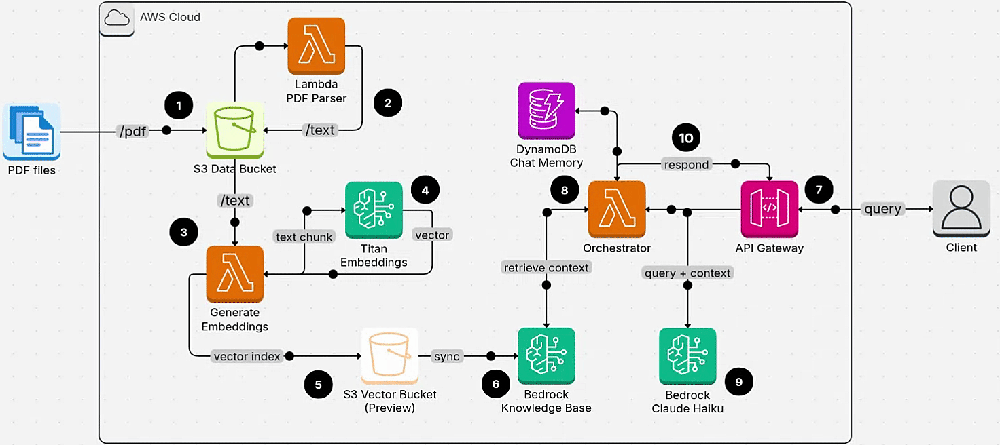

# RAG backed by S3 Vector Bucket (preview)

Build a serverless RAG system featuring the new S3 Vector Buckets for a **low-cost** solution.
Available on **US-EAST-1**

## Architecture diagram

## Deploying Infrastructure

* Run `sam build`
* Run `sam deploy --guided`

### Create Bedrock Knowledge Base backed by S3 Vector, CLI command:
Since Vector buckets as Bedrock Knowledge Base are not yet supported by SAM we do this via the CLI.
Point Bedrock Knowledge Base to the S3 Vector bucket and index created above from the outputs:

* Run `
aws bedrock-agent create-knowledge-base \
  --name "<envorionmet>-books-knowledge-base" \
  --description "Knowledge base backed by S3 vectors storage (preview add to SAM when available)" \
  --role-arn "<ARN from SAM output>" \
  --knowledge-base-configuration '{
    "type": "VECTOR",
    "vectorKnowledgeBaseConfiguration": {
      "embeddingModelArn": "arn:aws:bedrock:us-east-1::foundation-model/amazon.titan-embed-text-v2:0",
      "embeddingModelConfiguration": {
        "bedrockEmbeddingModelConfiguration": {
          "dimensions": 1024,
          "embeddingDataType": "FLOAT32"
        }
      }
    }
  }' \
  --storage-configuration '{
    "type": "S3_VECTORS",
    "s3VectorsConfiguration": {
      "vectorBucketArn": "<SAM output: VectorBucketArn>",
      "indexArn": "<SAM output: IndexArn>"
    }
  }' \
  --region us-east-1
`
